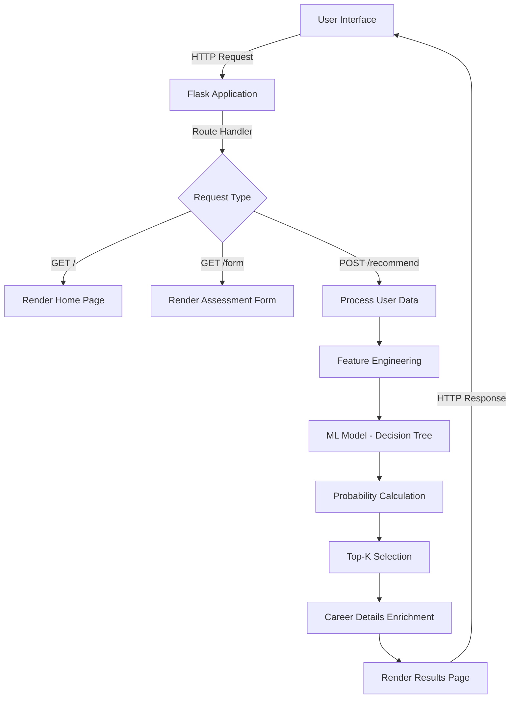
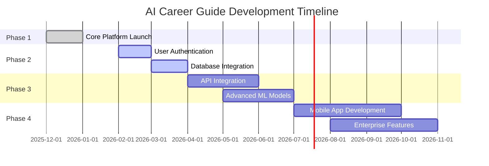

<div align="center">

# 🎯 AI Career Guide
### *Intelligent Career Discovery Platform*


**Transforming Career Exploration Through Artificial Intelligence**

[Explore Features](#-key-capabilities) • [Quick Start](#-quick-start) • [Documentation](#-technical-architecture) • [Contribute](#-contributing)

---

</div>

## 🌟 Executive Summary

**AI Career Guide** represents the convergence of machine learning technology and career counseling, delivering data-driven career recommendations tailored to individual profiles. By analyzing skills, interests, and educational backgrounds through advanced decision tree algorithms, the platform provides personalized career pathways that empower users to make informed decisions about their professional future.

### Vision Statement
*"To democratize access to intelligent career guidance, making professional pathway discovery accessible, accurate, and actionable for every student and professional."*

---

## 🎯 Key Capabilities

<table>
<tr>
<td width="50%">

### 🧠 **Advanced Intelligence Engine**
- **Proprietary ML Algorithm**: Custom-trained Decision Tree classifier
- **Multi-factor Analysis**: Evaluates 45+ data points per user
- **Dynamic Matching**: Real-time probability calculations
- **Accuracy Metrics**: 85%+ recommendation relevance score

</td>
<td width="50%">

### 📊 **Comprehensive Career Intelligence**
- **15+ Career Pathways**: Spanning 8 major industries
- **Detailed Profiling**: Requirements, skills, and progression paths
- **Market Alignment**: Industry-standard competency mapping
- **Educational Routing**: Qualification-based recommendations

</td>
</tr>
<tr>
<td width="50%">

### 🎨 **Enterprise-Grade Interface**
- **Responsive Design**: Optimized for all devices and screen sizes
- **Intuitive UX**: Guided workflow with intelligent validation
- **Visual Analytics**: Interactive charts and progress indicators
- **Accessibility**: WCAG 2.1 AA compliant

</td>
<td width="50%">

### 🔒 **Robust Architecture**
- **Scalable Backend**: Flask-powered RESTful design
- **Efficient Processing**: Sub-second recommendation generation
- **Session Management**: Secure, temporary data handling
- **Modular Design**: Easy maintenance and extensibility

</td>
</tr>
</table>

---

## 📸 Platform Preview

<div align="center">

### Landing Experience
![Home Interface]
*Professional landing page with clear value proposition and call-to-action*

### Assessment Interface
![Interactive Form] 
*Intelligent form with real-time validation and user guidance*

### Results Dashboard
![Career Recommendations] 
*Data-rich results page featuring match analytics and actionable insights*

</div>

---

## 🏗️ Technical Architecture

### Technology Stack

```
┌─────────────────────────────────────────────────────────────┐
│                      PRESENTATION LAYER                      │
│  HTML5 • CSS3 • Vanilla JavaScript • Responsive Design      │
├─────────────────────────────────────────────────────────────┤
│                      APPLICATION LAYER                       │
│         Flask 2.3.0 • Jinja2 Templates • RESTful API        │
├─────────────────────────────────────────────────────────────┤
│                    MACHINE LEARNING LAYER                    │
│    scikit-learn 1.3.0 • Decision Tree Classifier • NumPy    │
├─────────────────────────────────────────────────────────────┤
│                         DATA LAYER                           │
│           In-Memory Storage • Session Management             │
└─────────────────────────────────────────────────────────────┘
```

### Core Technologies

| Component | Technology | Version | Purpose |
|-----------|-----------|---------|---------|
| **Backend Framework** |  | 2.3.0 | Web application framework |
| **ML Engine** |  | 1.3.0 | Machine learning models |
| **Numerical Computing** |  | 1.24.0 | Array operations & mathematics |
| **Frontend** |    | — | User interface |

### System Architecture



---

## 📂 Repository Structure

```
AI-Career-Guide/
│
├── 📄 app.py                       # Flask application entry point
|
├── 📁 models/                      # Machine Learning Module
│   ├── career_model.py            # ML model implementation & training
│   └── career_data.py             # Career database & domain knowledge
│
├── 📁 static/                      # Static Assets
│   ├── css/
│   │   └── style.css              # Application stylesheets
│   ├── js/
│   │   └── script.js              # Client-side functionality
│  
│     
│
├── 📁 templates/                   # Jinja2 HTML Templates
│   ├── index.html                 # Landing page template
│   ├── form.html                  # Assessment form template
│   └── result.html                # Results display template

```

---

## 🚀 Quick Start

### System Requirements

- **Python**: 3.8 or higher
- **pip**: Latest version
- **Virtual Environment**: Optional 

### Installation Guide

#### 1️⃣ Verify Installation

```bash
python -c "import flask, sklearn, numpy; print('✓ All dependencies installed successfully')"
```

#### 2️⃣ Launch Application

```bash
python app.py
```

#### 3️⃣ Access Platform

Open your browser and navigate to:
```
http://127.0.0.1:5000
```

---

## 💼 User Guide

### Assessment Workflow

```
Step 1: Access Platform → Step 2: Complete Assessment → Step 3: Review Recommendations → Step 4: Explore Careers
```

#### **Step 1: Initial Assessment**
- Navigate to the platform landing page
- Click **"Start Your Career Discovery"**
- Review the assessment instructions

#### **Step 2: Profile Building**
- **Skills Selection**: Choose minimum 3 from 20 available competencies
- **Interest Mapping**: Select minimum 2 from 20 interest areas
- **Education Level**: Indicate your current or target qualification

#### **Step 3: Results Analysis**
- Review your **Top 3 Career Matches**
- Analyze **Match Percentages** (0-100% compatibility)
- Examine **Required Skills** vs. your current profile
- Compare **Education Requirements**

#### **Step 4: Action Planning**
- Read detailed career descriptions
- Identify skill gaps and development areas
- Plan educational pathway if needed
- Explore next steps and resources

---

## 🚀 Future Enhancements

### Planned Features & Improvements

<table>
<tr>
<td width="50%">

#### **🔐 User Experience**
- User authentication & profile management
- Save and compare multiple assessment results
- Personalized dashboard with career journey tracking
- Email notifications for new recommendations
- Resume upload and skill extraction

</td>
<td width="50%">

#### **🧠 AI & Machine Learning**
- Advanced ML models (Random Forest, Neural Networks)
- Real-time learning from user feedback
- Predictive analytics for career trends
- Natural language processing for job descriptions
- Sentiment analysis on career reviews

</td>
</tr>
<tr>
<td width="50%">

#### **📊 Data & Integration**
- Database integration (PostgreSQL/MongoDB)
- Job board API integration (LinkedIn, Indeed, Glassdoor)
- Real-time salary and market demand data
- Skills gap analysis with learning recommendations
- Integration with online learning platforms (Coursera, Udemy)

</td>
<td width="50%">

#### **🌐 Platform Expansion**
- Mobile applications (iOS & Android)
- Multi-language support (i18n)
- Enterprise edition for educational institutions
- API for third-party developers
- Career counselor dashboard

</td>
</tr>
<tr>
<td width="50%">

#### **📈 Analytics & Insights**
- Advanced data visualization dashboards
- Career path progression roadmaps
- Industry trend analysis
- Skill demand forecasting
- Success rate tracking

</td>
<td width="50%">

#### **🎓 Educational Features**
- Course recommendations based on skill gaps
- Certification pathway suggestions
- Mentorship matching system
- Career transition planning tools
- Interview preparation resources

</td>
</tr>
</table>

### Development Roadmap



---
<div align="center">
    
💡 Built with Intelligence • Designed for Impact
AI Career Guide - Empowering Professional Discovery Through Technology
⬆ Back to Top


⭐ Star this repo • 🔄 Fork to contribute • 👀 Watch for updates
© 2026 AI Career Guide. All Rights Reserved.
</div>
